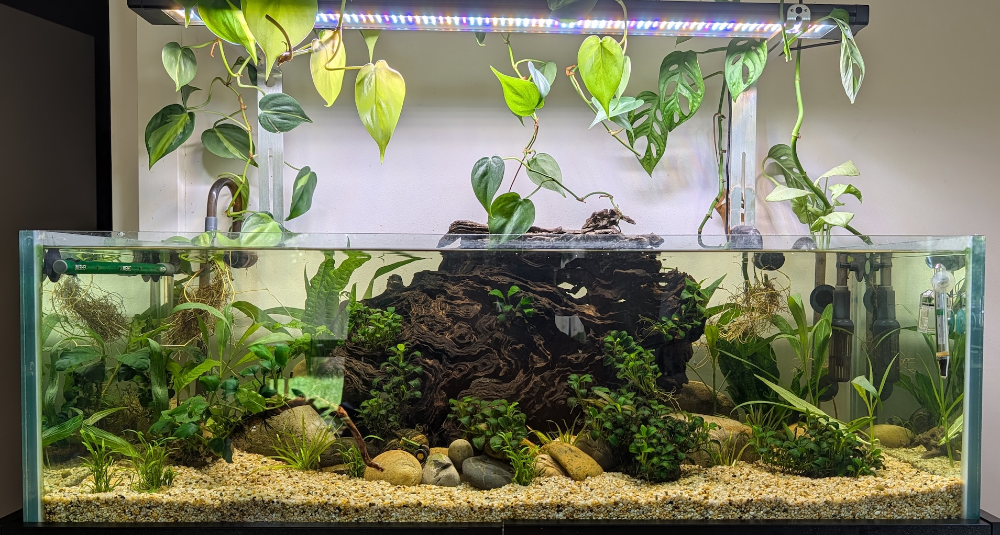

# April 2026

## 2026-04-10

Tank seems healthy but quite a few red algae hanging on the plants. Fish are mostly happy.

### Observations

- Can't see the glass catfish or the ghostknife even though I saw the latter fins moving around.
- One shrimp only, can't see the other one.
- Fish seem to be concentrating around the airbubble at the back.

### Actions

N/A

### Photos

---
