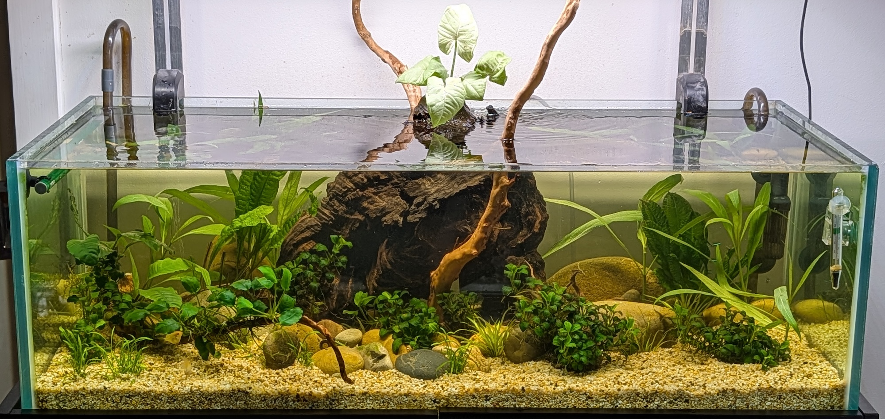
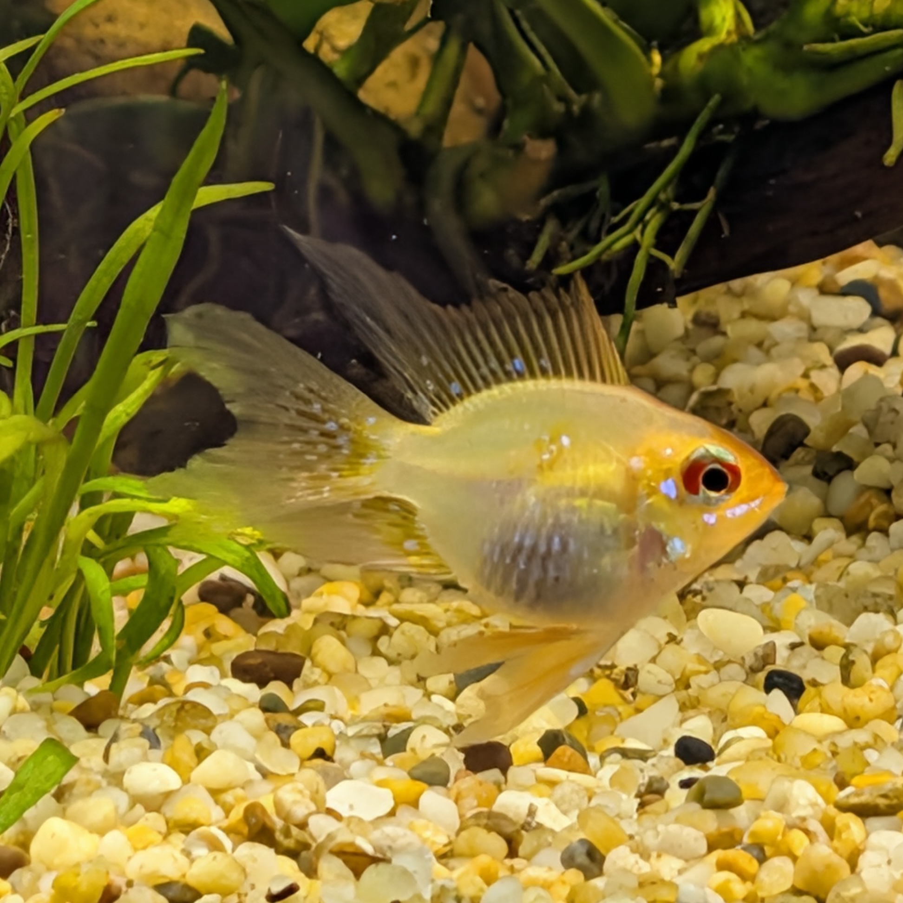

# April 2026

## 2026-04-27

50% water change with a few of other changes:

- Removed the inline CO2 diffuser and replaced it with an in-tank one.
- Cleaned the canister by removing phosphate pads and replacing the top sponge
- Added Purigen to clean up the water

Fish seem mostly happy. Unfortunately the Ghost catfish was being bullied and was not very happy so I moved it to the other tank - haven't checked on it yet.

Some algae growth, especially green and red. I have added more plants - including java moss - and am hoping that this will help with the algae growth. I also added a monstera to the back and a healthy stick of brazilian vine that I hope will grow like the other tank. Only time will tell.

Also stopped dosing micro nutrients for the plants for now.

Measuring the water yielded somewhat consistent results, which is good: ammonia decreased and GH is kinda weird again but in general water parameters are good.

Even with the Purigen the water is still not 100% clear. I don't think it is a matter of time but I guess we gotta keep doing those water changes until things clear up.

The [H2O2 treatment from the other day](#2026-04-19) did not really yield positive results. I might try again in the future but for now I will just let it be ... trimming the plants might be more effective than dosing them with chemicals.

On the positive side I am seeing some root growth on the anubias and in general the plants are healthy. Just the bloody algae is annoying.

### Photos

## 2026-04-19

Did a 50% water change. Along with that I also treated 2 bunches of anubias to a hydrogen peroxide solution which yilded some small immediate results but looks like the treatment really takes a few days. Got the treatment plan [from this website](https://helpusfish.com/30/black-beard-algae-hydrogen-peroxide.html).

I also dosed the tank:

- 2ml API Tap Water
- 3ml Carbon Max
- 8ml Excel Trace Elements

### Observations

The Black Balloon Longfin Ram seems to have adapted well but I can't find the catfish anymore. Will keep an eye out for it - however I almost sucked up a tiny shrimp. At least one is alive but not sure where they are.

*UPDATE:* Catfish still there! \o/

### Actions

- Water change
- Dosage

## 2026-04-18

Added a new species of fish - Black Balloon Longfin Ram - and more green neon tetras. Also some duckweed came with the bag so might cultivate it.

### Observations

Algae have reduced quite substantially. Still have some stuck on some grass but they differ on type: I think some of them are red and some are black but the black ones are usually stuck to the anubias which will probably force my hand in removing them from the tank to do some treatment with hydroperoxide -- or I might just trim the leaves, don't know.

The Ghostknife liked his new "cave" structure and hangs about there quite a lot which is great to see. It might need a companion though. Will consider it.

## 2026-04-15

Started dosing Flourish Sachem. Did a water change yesterday (~ 50%) and fish seem healthy which is great but no shrimps anymore -- looks like the Ghostknife ate them.

### Observations

Ammonia unusually high. Probably because of the nutrients, might do a water change tomorrow.

### Photos

## 2026-04-13

Changed the wood decoration. Now The tank doesn't seem so full but I feel like I need more plants. Some anubias are floating at the moment and I'll do a water change tomorrow and I must take the opportunity to try and clean the black algae.

### Observations

- One shrimp died - it jumped out, probably trying to run from the Ghostknife.
- Only one Ghost catfish left :-(

## 2026-04-10

Tank seems healthy but quite a few red algae hanging on the plants. Fish are mostly happy.

### Observations

- Can't see the glass catfish or the ghostknife even though I saw the latter fins moving around.
- One shrimp only, can't see the other one.
- Fish seem to be concentrating around the airbubble at the back.

### Actions

N/A

### Photos

---
