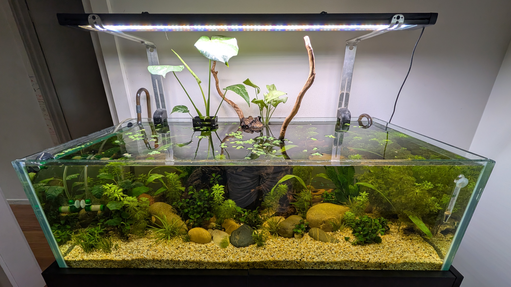
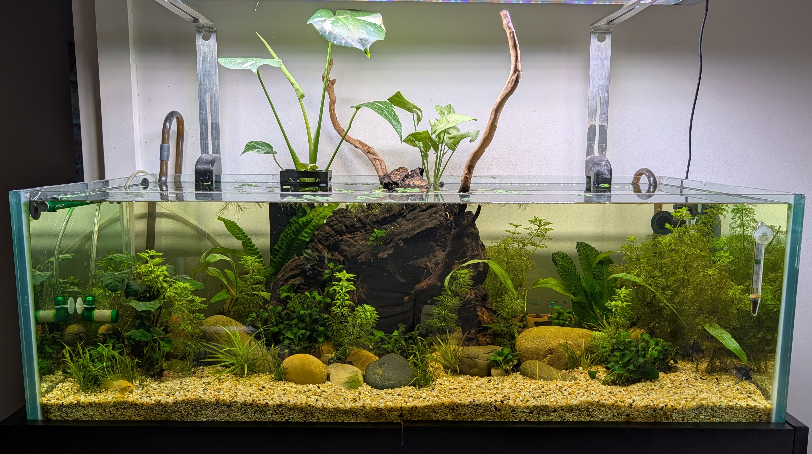
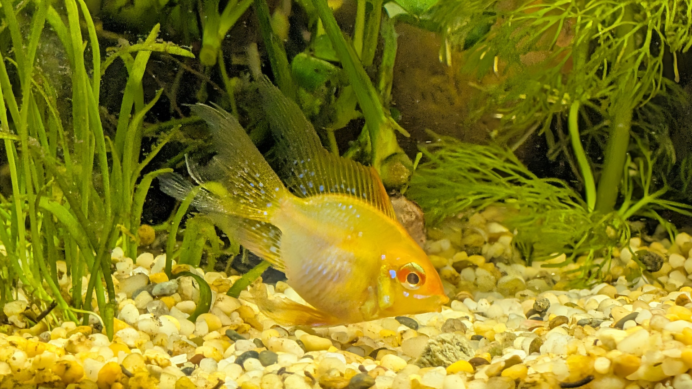
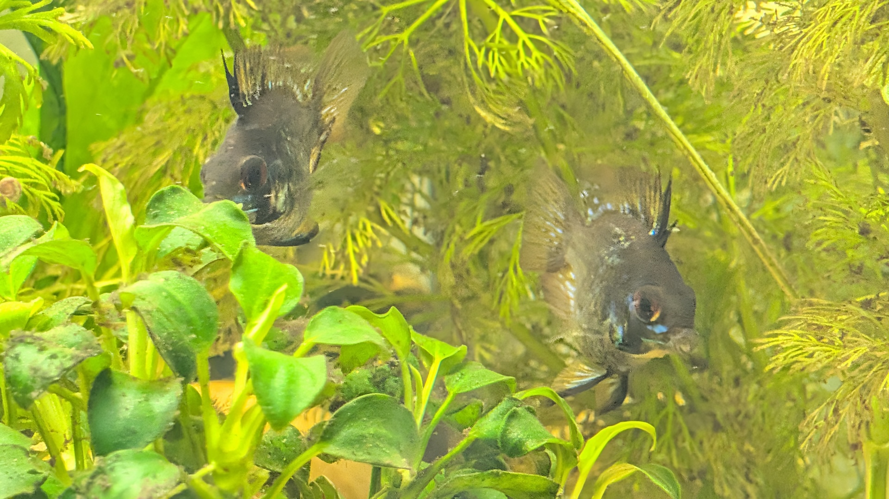

# May 2026

## 2026-05-24

Massive water change yesterday, 50%+. Did so I could dose with the new all-in-one fertiliser I got the other day and looks like it yielded good results as the fish are a bit more active than normal and tannins in water have mostly gone but only time will tell really.

I feel like I found the optimal position for the outlet where water keeps circuling at the top and allow for spread of food where the fish go for it and feel safe to go for it. I will keep monitoring.

I'ts great to see the floating plants growing though: it looks like when they spread well enough there might be enough coverage to reduce the light so I might not need to invest in a new lighting kit but the diffusing might be worthwhile even though I don't want to do it for a while as I want the water lettuce to absorb as much light as and nutrients as possible.

Talking about plants I did do a H2O2 treatment again yesterday:

- took all the anubias mostly affected by black beard
- trimmed the most affected leaves
- broke them down into smaller bunches and tied them up to rocks
- sprayed H2O2 on all of them and let for about 5 ~ 10 minutes
- rinsed and put them back into more shady areas

It seems like anubias like the shade more and will respond better to that. The water lettuce will help provide shade a bit more but I'm mostly keen on seeing if the treatment is successful or not: it was kind of an eye sore to see so much black around the anubias and the7y are now looking slightly better but it seems like it needs some time for the treatment to really take effect.

Finally with the other fast growing plants, they seem to be doing just fine. I do want to monitor the other plants as their leaves are slightly yellow and I hope the fertiliser witll help with that a bit more.

The fertliliser in question is from [AquaLabs, Lean Grow](https://www.aqualabs.com.au/products/aqualabs-lean-grow) product. I never used it before but it seems it has a good combination of macro and trace nutrients to dose the water column - what I'm not sure is if the plants in question showing yellowing leaves feed from the roots or the water column. The guy at the shop wasn't so clear on that one but, you know, we can only try.

Otherwise the tank is doing well and the plants growing outside of the tank are thriving too so I guess I must be doing something right!

## Photos

## 2026-05-19

Did a water change over the weekend and parameters are holding steady. Plants are growing slowly and black beard algae still a nuisance but oterhwise tank is healthy -- I believe I need to trim those anubias and reduce light intensity so black beard is under control; not entirely sure what to do yet but the fact it's not getting worse (or getting worse slowly) is a good sign.

I have also introduce floating lettuce to try and reduce the light intensity, hope they will spread quickly.

I'm not sure if fish are overly satisfied though: the neons keep in the corner only coming ou when the light is out. The other fish are active and healthy and I even found a shrimp there, which was a pleasant surprise. The rams are always happy to poke about, I might get more of these guys as I really like them! But I'd like to see more of the tetras swimming around... I'm hoping that by reducing the light intensity they might feel more comfortable around the tank.

I don't want to introduce more plants right now and I hope I can keep this under control. I bought this fertiliser solution which I think will make my life a lot easier as it's a single dosage containing all macro and trace nutrients... let's see, gotta do a water change first.

### Actions
- Water change on the weekend.
- Try to diffuse the light a bit more.
